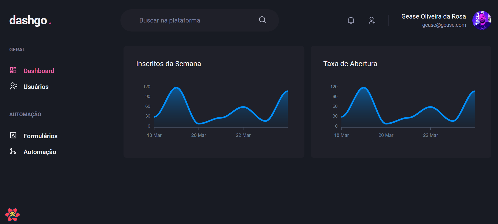

<div align="center">
  <p align="center">
    
  </p>
 <h1>Dashgo </h1>
 <h3>Projeto em Reactjs, Chackra-UI, React-Query, Miragejs<h3>
</div>

```bash
yarn add typescript @types/react @types/node -D
```

```
yarn add  @chakra-ui/react @chakra-ui/core @emotion/react @emotion/styled framer-motion
```

```
yarn add  react-icons
```

```
yarn add react-hook-form
```

```
yarn add yup @hookform/resolvers
```

```
yarn add miragejs -D
```

```
yarn add faker -D
```

```
yarn add @types/faker -D
```

```
yarn add react-query
```

```
yarn add axios
```
